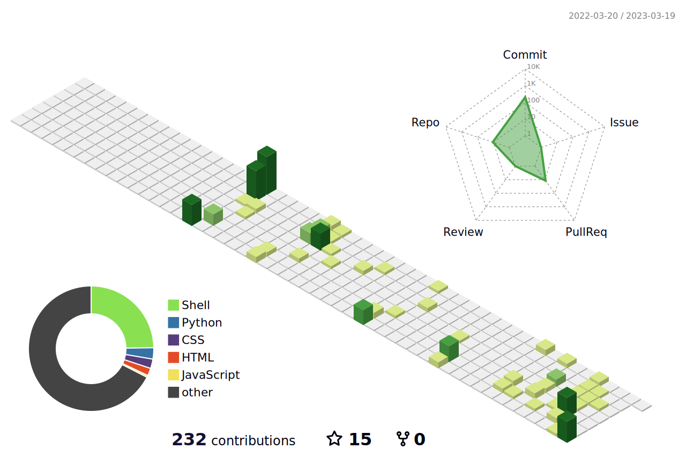

 

<h2 align="center">🌱 I’m Currently Learning</h2>

 
<a href="https://www.python.org/">
<a href="https://html.spec.whatwg.org/">
<a href="https://www.w3.org/TR/CSS/#css">

<h2 align="center">🛠️ Languages & Tools</h2>

<a href="https://www.python.org/">
<a href="https://html.spec.whatwg.org/">
<a href="https://www.w3.org/TR/CSS/#css">
<a href="https://getfedora.org/">
<a href="https://www.raspberrypi.org/">
<a href="https://www.kernel.org/">
<a href="https://alacritty.org/">
<a href="https://github.com/">
<a href="https://vscodium.com/">
<a href="https://helix-editor.com/">

<h2 align="center">🔎 Profile Details</h2>

<h2 align="center">📊 GitHub Statistics</h2>

 

 
  

<h2 align="center">🏆 Achievements</h2>

 

 

