  

    
  

 

 
    
<h2 align="center">
  
  My Statistics
</h2>

  

    
    
    
    
    
    
    
  

   
  

    
  

 

 

<h2 align="center">
  
  Technologies
</h2>

  
   
  
    This Octocat was made using <a href="https://myoctocat.com/">myoctocat.com</a>.
    I'm not affiliated with GitHub in any way.
  

  <table>
    <tr>
      <th>Categories</th>
      <th>Technologies</th>
    </tr>
    <tr>
      <td>Languages</td>
      <td>
        

          
          
          
          
        

      </td>
    </tr>
    <tr>
      <td>Text Editors & IDEs</td>
      <td>
        

          
          
          
        

      </td>
    </tr>
    <tr>
      <td>Version Control</td>
      <td>
        

          
        

      </td>
    </tr>
    <tr>
      <td>Terminal</td>
      <td>
        

          
          
          
        

      </td>
    </tr>
    <tr>
      <td>Operating Systems</td>
      <td>
        

          
          
          
        

      </td>
    </tr>
  </table>

 

<h2 align="center">
  
  Gists
</h2>

  

 

 

  

